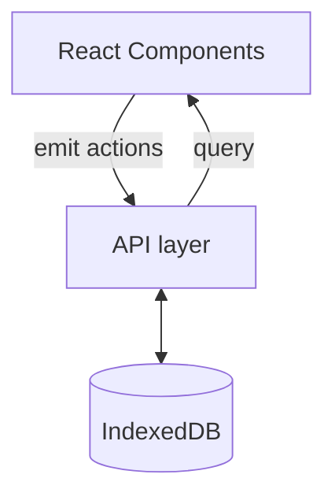

# Kanban

DEMO: https://kresli.github.io/kanban/board/kanban-demo

An offline-friendly Kanban board that showcases my approach to building modular front-end applications. Everything runs locally in the browser thanks to IndexedDB, yet the UI behaves like a production SaaS product with multi-list boards, drag-and-drop cards, and rich activity timelines.


## Product Highlights

- Multi-board layout with instant drag-and-drop reordering across lists using fractional positioning math.
- Card details modal that merges Markdown comments, edit history, and generated change commits into a single timeline.
- Full Markdown support in every card comment, powered by `react-markdown`, so descriptions render headings, lists, and inline code.
- Built-in demo board seeding plus clone/export/import flows powered by Dexie so you can snapshot or branch the data set.
- Responsive Tailwind-driven UI with floating menus, contextual toolbars, and accessible keyboard/focus management.

## Main Tech

- **React 18 + TypeScript + Vite** for fast iteration and type-safe components.
- **Dexie + dexie-react-hooks + IndexedDB** for offline persistence, live queries, and database export/import.
- **React Query 3** to cache board-level resources and share the API client across routes.
- **React Router 7** for nested layouts (`/board/:id`, `/card/:id`) and modal routing.
- **Tailwind CSS 4**, `@floating-ui/react`, and Tabler Icons for styling and polished micro-interactions.
- **Storybook 8**, **ESLint/Prettier**, and **Vitest** to document UI states and keep the codebase consistent.

## Architecture

I separate the UI, data-access layer, and persistence so each concern stays testable:



- **Components** live under `src/components` and stay dumb by receiving hooks/services instead of reaching into storage directly.
- **API modules** (e.g., `ApiCard`, `ApiComment`) wrap Dexie tables and emit commit records so the timeline view has a normalized source of truth.
- **Dexie** exposes typed stores (cards, lists, boards, comments, commits) and is initialized once through `ApiProvider`, which also hydrates the demo board.

## State Management & Data Flow

- **React Query** holds long-lived board entities. `QueryClient` gets initialized in `App` with `staleTime: Infinity`, which keeps board metadata cached while live queries stream updates.
- **dexie-react-hooks** provides `useLiveQuery`, so lists, cards, and activities re-render immediately when IndexedDB changes—no manual refetching required.
- **Card draft state** (`useCardDraftState`) maintains the card being dragged, mirrors changes locally, and persists them via the API once the drop completes.
- **Context**: `ApiContext` exposes the typed API instance, giving hooks/components a single source for CRUD, cloning, import/export, and timeline aggregation.

## Project Structure

| Path | Purpose |
| --- | --- |
| `src/components` | UI building blocks (Board, List, Card, CardDetailsModal, shared buttons, menus). |
| `src/routes` | SPA routing configuration plus modal-driven navigation between boards and cards. |
| `src/api` | Domain-specific gateways (board/list/card/comment/commit) and demo board utilities. |
| `src/database` | Dexie database definition and typed schemas for every entity. |
| `src/hooks` | Reusable hooks for API access, drag state, date formatting, and navigation helpers. |
| `src/contexts` | React contexts such as `ApiContext` used by providers. |
| `public` | Static assets served by Vite. |

## Local Development

```bash
pnpm install          # install dependencies
pnpm dev              # start Vite dev server
pnpm storybook        # explore components in isolation
pnpm test             # run Vitest suites
pnpm lint             # run ESLint
pnpm build            # production build
pnpm build:gh-pages   # build with gh-pages env (uses .env.gh via dotenvx)
```

Open <http://localhost:5173> after running `pnpm dev`; the `ApiProvider` seeds the demo board automatically, and you can clone it to test persistence scenarios without resetting your data.

## License

Released under the MIT License. You may use, copy, modify, and ship the app commercially as long as you keep the original copyright notice.
